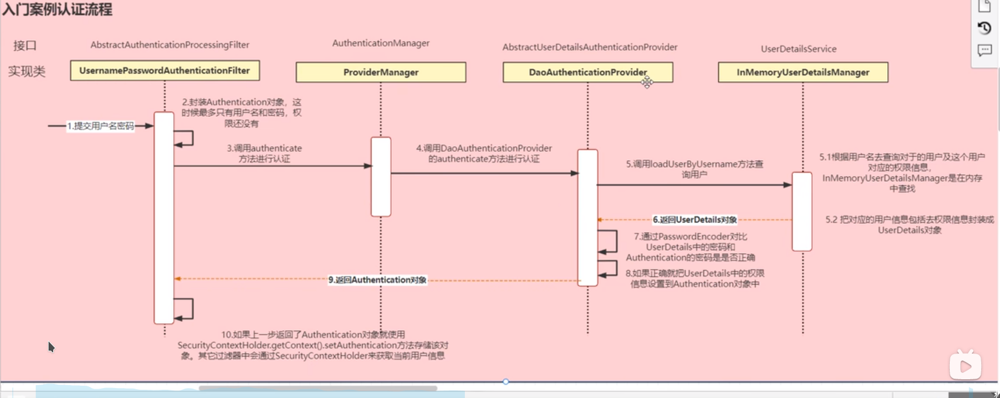
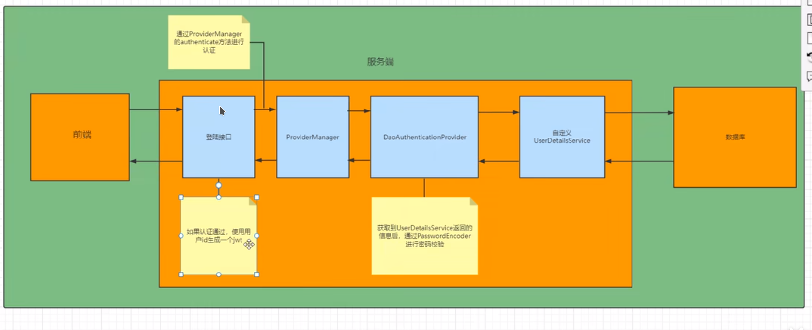
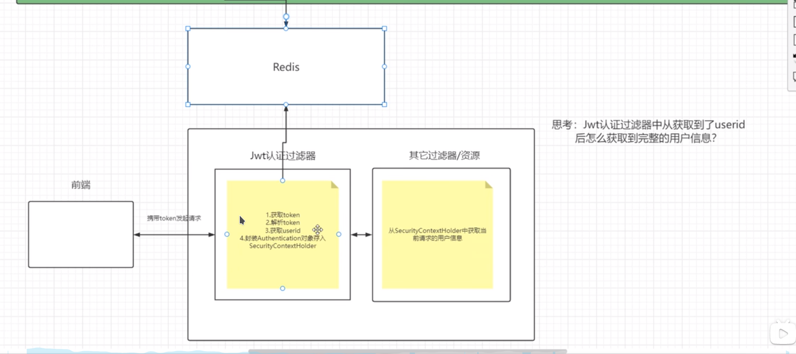

## 5.25

1. 

```java
LambdaQueryWrapper<Article> articleLambdaQueryWrapper=new LambdaQueryWrapper<>();
```

2. categoryid->categoryName,在VO中，因为categoryName为@TableName(exist=false)

3. @PathVariable

4. FastJson配置在webconfig中，以及中文乱码

5. List<Link> list = list();

## 5.26

1. - 需要暴露

```java
@Autowired
    private AuthenticationManager authenticationManager;

```

  同时在securtyconfig中要暴露出来，同时用@bean装配到容器中，注意

```txt
authenticationManager()和WebSecurityConfigurerAdapter的authenticationManagerBean()是两个不同的方法，并且		   
 您正在调用超类的 authenticationManagerBean() 方法，据我所知，这取决于 authenticationManager() 方法.这反过来会	
 创建方法的循环调用，最终导致 	StackOverflowError 异常
```

```
所以
@Bean
    @Override
    public AuthenticationManager authenticationManager() throws Exception {
        return super.authenticationManagerBean();
    }
    
    改为以下
    
    @Bean
    @Override
    public AuthenticationManager authenticationManagerBean() throws Exception {
        return super.authenticationManagerBean();
    }
```

- 同时还需要实现UserDetailsService接口并且重写loadUserByUsername方法，注意加上@Service,因为不加这个会导致authenticationManager在调用authenticate时找不到loadUserByUsername就会报错！！

- 在接收authenticate返回结果时：

  ```
  LoginUser loginUser = (LoginUser) authenticate.getPrincipal();
  //注意一定要用实现了UserDetails的实体类去接收
  ```

  

2. 无法自动装配config'中返回的类：

需要在config文件上加上@Configuration

3. @Accessors(chain = true)可以链式生成

4. @compont和utlis的区别？？

5. 报错：java.lang.NoClassDefFoundError: javax/xml/bind/DatatypeConverter

   ```
   
   <dependency>
               <groupId>javax.xml.bind</groupId>
               <artifactId>jaxb-api</artifactId>
               <version>2.3.0</version>
           </dependency>
           java9以上没有这些javax的依赖，所以需要手动加入
   ```

6. 

## 5.29

1. 整个securtity的过程







2. 添加filter时也需要在filter上加上compont注解，才能够在security的config中加上自己的filter，加入自己的fliter时要注入，在自定义异常处理的时候也要注入

3. 在用filter报错返回给前端的时候不是抛异常，而是用用自己的webutlis去返回给前端，注意要将字符串变为json格式

   ```java
   WebUtils.renderString(response, JSON.toJSONString(result));
   ```

   

4. 用StringUtlis.hastest判断字符串是不是空，用Objects.isNull判断对象是不是空

5. 在用userDetails去接之后，

   ```java
   Authentication authenticate = authenticationManager.authenticate(authenticationToken);
   ```

   在copy为vo的时候，需要authenticate.getUser

   ```java
    UserInfoVo userInfoVo = BeanCopyUtils.copyBean(loginUser.getUser(), UserInfoVo.class);
   ```

6. 学会调试，注意setRedisCache的时候的key和getRedisCache的key要一一致

## 5.30

1. 在application.yml中冒号后面需要加空格

2. @resource和@autowired使用场景和区别：[https://blog.csdn.net/u012206730/article/details/102895250](https://blog.csdn.net/u012206730/article/details/102895250)

   - resource是通过name,@Service（“userService”），去找的，没有写userService。默认就是类名
   - autowired通过类型去找
   - autowired更快，相当于是id

3. 读取application.yml中的文件的时候需要在主运行application中加上

   ```
   @ConfigurationPropertiesScan
   @EnableConfigurationProperties
   ```

​		以及在引用类中加上@ConfigurationProperties(prefix = "oss")，然后还需要有set和get方法

4. 枚举之间用逗号隔开，枚举的作用就是把有关的常量常量串联起来

5. 自己定义日期输出格式

   `````java
   //根据日期生成路径   2022/1/15/
           SimpleDateFormat sdf = new SimpleDateFormat("yyyy/MM/dd/");
           String datePath = sdf.format(new Date());
   `````

6. 当前端传来的是json数据的时候，就需要在controller接受参数的时候加上@requestBody

## 5.31

1. 查找maven依赖是否添加，可以生成依赖树，然后再ctrl+f搜索即可

2. 获取请求的报文：

   `````java
   ServletRequestAttributes requestAttributes = (ServletRequestAttributes)RequestContextHolder.getRequestAttributes();
       
   `````

3. 当返回的是一个接口，应该点进接口去查看他的实现类，ctrl+alt加鼠标左键，可以找到，当需要调用子类的特有方法的时候，需要将父类强制转为子类，

4. 定义日志aop切面：

   - 首先应该自定义注解：

     `````java
     @Target(ElementType.METHOD)
     @Retention(RetentionPolicy.RUNTIME)
     public @interface systemLog {
         String businessName();
     }
     `````

   - 其次定义切面类：

     `````java
     @Component
     @Aspect
     @Slf4j
     public class logAspect {
     `````

   - 接着定义切点：

     `````java
      @Pointcut("@annotation(swu.lj.annotation.systemLog)")
         public void pt(){
     
         }
     `````

   - 接着定义增强方法：

     `````java
     @Around("pt()")
         public Object printLog(ProceedingJoinPoint joinPoint) throws Throwable {
             Object ret=null;
             try {
                 handleBefore(joinPoint);
                 ret = joinPoint.proceed();
                 handleAfter(ret);
             } finally {
                 log.info("--------end-------"+System.lineSeparator());
             }
             return ret;
     
         }
     
     `````

   - 接着在之前和之后获取信息：

     `````java
     private void handleBefore(ProceedingJoinPoint joinPoint) {
             ServletRequestAttributes requestAttributes = (ServletRequestAttributes)RequestContextHolder.getRequestAttributes();
             HttpServletRequest request = requestAttributes.getRequest();
             //getSystemLog
             MethodSignature signature = (MethodSignature)joinPoint.getSignature();
             systemLog systemLog = signature.getMethod().getAnnotation(systemLog.class);
     
             log.info("=======Start=======");
             // 打印请求 URL
             log.info("URL            : {}",request.getRequestURI());
             // 打印描述信息
             log.info("BusinessName   : {}", systemLog.businessName());
             // 打印 Http method
             log.info("HTTP Method    : {}", request.getMethod());
             // 打印调用 controller 的全路径以及执行方法
             log.info("Class Method   : {}.{}", joinPoint.getSignature().getDeclaringTypeName(),((MethodSignature)joinPoint.getSignature()).getName());
             // 打印请求的 IP
             log.info("IP             : {}",request.getRequestURL());
             // 打印请求入参
             log.info("Request Args   : {}", JSON.toJSONString(joinPoint.getArgs()));
     
         }
     `````

   - 所以整体代码：

     `````java
     package swu.lj.aspect;
     
     import com.alibaba.fastjson.JSON;
     import lombok.extern.slf4j.Slf4j;
     import org.aspectj.lang.ProceedingJoinPoint;
     import org.aspectj.lang.Signature;
     import org.aspectj.lang.annotation.Around;
     import org.aspectj.lang.annotation.Aspect;
     import org.aspectj.lang.annotation.Pointcut;
     import org.aspectj.lang.reflect.MethodSignature;
     import org.springframework.stereotype.Component;
     import org.springframework.web.context.request.RequestContextHolder;
     import org.springframework.web.context.request.ServletRequestAttributes;
     import swu.lj.annotation.systemLog;
     
     import javax.servlet.http.HttpServletRequest;
     
     @Component
     @Aspect
     @Slf4j
     public class logAspect {
         @Pointcut("@annotation(swu.lj.annotation.systemLog)")
         public void pt(){
     
         }
     
         @Around("pt()")
         public Object printLog(ProceedingJoinPoint joinPoint) throws Throwable {
             Object ret=null;
             try {
                 handleBefore(joinPoint);
                 ret = joinPoint.proceed();
                 handleAfter(ret);
             } finally {
                 log.info("--------end-------"+System.lineSeparator());
             }
             return ret;
     
         }
     
         private void handleAfter(Object ret) {
             // 打印出参
             log.info("Response       : {}", JSON.toJSONString(ret));
         }
     
         private void handleBefore(ProceedingJoinPoint joinPoint) {
             ServletRequestAttributes requestAttributes = (ServletRequestAttributes)RequestContextHolder.getRequestAttributes();
             HttpServletRequest request = requestAttributes.getRequest();
             //getSystemLog
             MethodSignature signature = (MethodSignature)joinPoint.getSignature();
             systemLog systemLog = signature.getMethod().getAnnotation(systemLog.class);
     
             log.info("=======Start=======");
             // 打印请求 URL
             log.info("URL            : {}",request.getRequestURI());
             // 打印描述信息
             log.info("BusinessName   : {}", systemLog.businessName());
             // 打印 Http method
             log.info("HTTP Method    : {}", request.getMethod());
             // 打印调用 controller 的全路径以及执行方法
             log.info("Class Method   : {}.{}", joinPoint.getSignature().getDeclaringTypeName(),((MethodSignature)joinPoint.getSignature()).getName());
             // 打印请求的 IP
             log.info("IP             : {}",request.getRequestURL());
             // 打印请求入参
             log.info("Request Args   : {}", JSON.toJSONString(joinPoint.getArgs()));
     
         }
     }
     
     `````

5. string转为long

   `````java
   Long.valueOf(key)
   `````

   把int转为long

   `````java
   entry.getValue().longValue())
   `````

   long转为int

   `````java
   entry.getValue().intValue())
   `````

6. mp批量更新部分字段

   `````java
   articleService.updateBatchById(articles);
   `````

   

